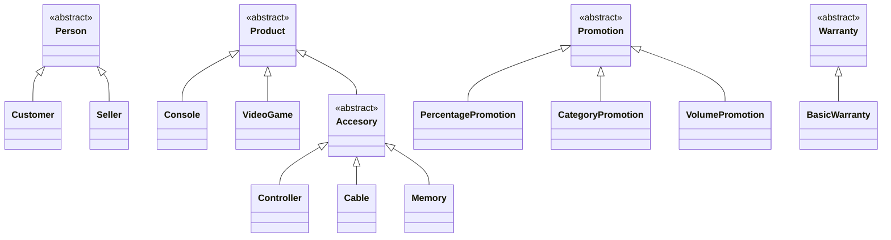

```mermaid
classDiagram
    class Product {
        <<abstract>>
    }

    class Accesory {
        <<abstract>>
    }

    class Promotion {
        <<abstract>>
    }

    class Warranty {
        <<abstract>>
    }

    class Person {
        <<abstract>>
    }

    Person <|-- Customer
    Person <|-- Seller

    Product <|-- Console
    Product <|-- VideoGame
    Product <|-- Accesory

    Accesory <|-- Controller
    Accesory <|-- Cable
    Accesory <|-- Memory

    Promotion <|-- PercentagePromotion
    Promotion <|-- CategoryPromotion
    Promotion <|-- VolumePromotion

    Warranty <|-- BasicWarranty
```
